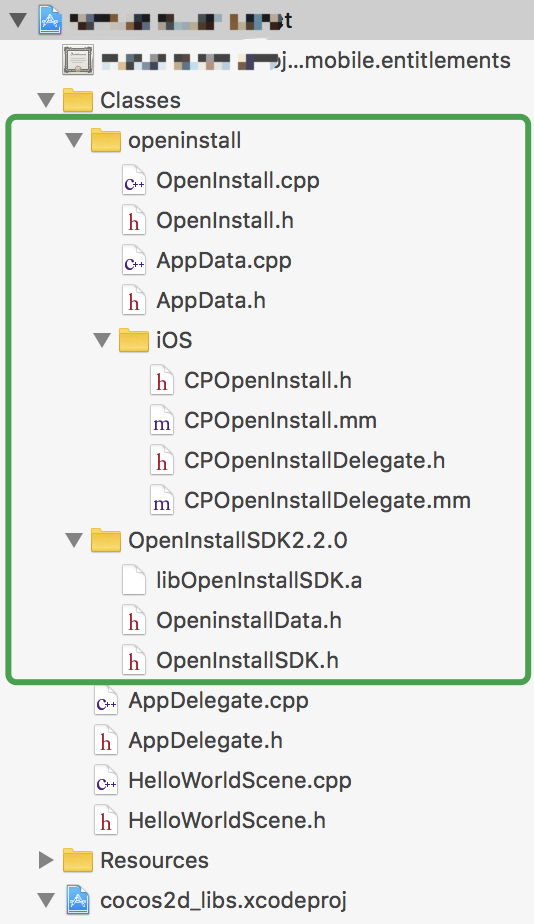

# iOS 集成指南

## 拷贝文件并导入

- 将 `Classes/openinstall` 文件夹拷贝到项目的 `Classes` 目录下
- 将 `iOS` 目录下的 `OpenInstallSDKx.x.x` 拷贝到源文件目录下
- 导入 `Classes/openinstall` 目录下的 C++ 源文件、iOS 相关文件以及 iOS 目录下的 `OpenInstallSDKx.x.x` 到工程中
最终工程目录结构如下：  

## 配置项目

#### 初始化配置
根据 openinstall 官方文档，在 Info.plist 文件中配置 appKey 键值对，如下：

``` xml
	<key>com.openinstall.APP_KEY</key>
	<string>“从openinstall官网后台获取应用的appkey”</string>
```

### 以下为 `一键拉起` 功能的相关配置和代码

#### universal links配置（iOS9以后推荐使用）

对于 iOS，为确保能正常跳转，AppID 必须开启 Associated Domains 功能，请到 [苹果开发者网站](https://developer.apple.com)，选择 Certificate, Identifiers & Profiles，选择相应的 AppID，开启 Associated Domains。  
__注意__：当 AppID 重新编辑过之后，需要更新相应的 mobileprovision 证书。(图文配置步骤请看 [iOS集成指南](https://www.openinstall.io/doc/ios_sdk.html))  
- 在左侧导航器中点击您的项目
- 选择 `Capabilities` 标签
- 打开 `Associated Domains` 开关
- 添加 openinstall 官网后台中应用对应的关联域名（openinstall应用控制台->iOS集成->iOS应用配置->关联域名(Associated Domains)）  

在 `AppController.mm` 中引入头文件 `OpenInstallSDK.h` ，并添加通用链接(Universal Link)回调方法，委托OpenInstallSDK来处理

``` objc
#import "OpenInstallSDK.h"

-(BOOL)application:(UIApplication *)application continueUserActivity:(NSUserActivity *)userActivity restorationHandler:(void (^)(NSArray * _Nullable))restorationHandler{
    //判断是否通过OpenInstall Universal Link 唤起App
    [OpenInstallSDK continueUserActivity:userActivity];
    
    //其他第三方回调:
    return YES;
}
```

**openinstall完全兼容微信openSDK1.8.6以上版本的通用链接跳转功能，注意微信SDK初始化方法中，传入正确格式的universal link链接：**  

``` objc
//your_wxAppID从微信后台获取，yourAppkey从openinstall后台获取
[WXApi registerApp:@"your_wxAppID" universalLink:@"https://yourAppkey.openinstall.io/ulink/"];
```

微信开放平台后台Universal links配置，要和上面代码中的保持一致  


- 微信SDK更新参考[微信开放平台更新文档](https://developers.weixin.qq.com/doc/oplatform/Mobile_App/Access_Guide/iOS.html)  


#### scheme配置

在 `Info.plist` 文件中，在 `CFBundleURLTypes` 数组中添加应用对应的 scheme，或者在工程“TARGETS-Info-URL Types”里快速添加，图文配置请看[iOS集成指南](https://www.openinstall.io/doc/ios_sdk.html)  
（scheme的值详细获取位置：openinstall应用控制台->iOS集成->iOS应用配置）

``` xml
	<key>CFBundleURLTypes</key>
	<array>
	    <dict>
		<key>CFBundleTypeRole</key>
		<string>Editor</string>
		<key>CFBundleURLName</key>
		<string>openinstall</string>
		<key>CFBundleURLSchemes</key>
		<array>
		    <string>"从openinstall官网后台获取应用的scheme"</string>
		</array>
	    </dict>
	</array>
```

在 `AppController.mm` 中引入头文件 `OpenInstallSDK.h` ，并添加 `scheme` 的回调方法，委托 OpenInstallSDK 来处理

``` objc
#import "OpenInstallSDK.h"

//支持目前所有版本的iOS
-(BOOL)application:(UIApplication *)application openURL:(NSURL *)url sourceApplication:(NSString *)sourceApplication annotation:(id)annotation{
    //判断是否通过OpenInstall URL Scheme 唤起App
    [OpenInstallSDK handLinkURL:url];
    //其他第三方回调:
    return YES;

}

//注意：在iOS9.0以上的设备中，下面这个系统方法会覆盖上面的系统方法（主要考虑到微信登录等业务），请结合自身业务来调用
//一般情况下，只要本地有下面的方法存在，则在下面方法中必须调用openinstall的相关api，没有下面方法的情况下可以只在上面的方法中调用openinstall的相关api

//支持iOS9以上
- (BOOL)application:(UIApplication *)app openURL:(NSURL *)url options:(nonnull NSDictionary *)options{
    //判断是否通过OpenInstall URL Scheme 唤起App
    [OpenInstallSDK handLinkURL:url];

    //其他第三方回调:
     return YES;
}

```

#### 广告平台对接

请参考详细文档 [iOS集成指引](https://www.openinstall.io/doc/ad_ios.html)，在 `Classes/openinstall/iOS/CPOpenInstall.mm` 中修改初始化方法，加入广告相关API。
