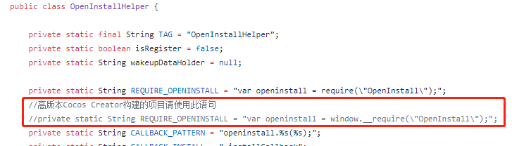

# Android 集成指南

## 导出工程
- 在菜单 `项目` -> `构建发布` 弹框中，发布平台选择 `Android`，勾选上 `Android Studio`，填写其他配置，最后点击 `构建`
- 构建完成后，使用 `Android Studio` 打开位于 `${projectDir}/build/jsb-link/frameworks/runtime-src/proj.android-studio` 的 Android 工程。

## 拷贝文件
- 将 `Android` 目录下的 `src` 文件夹下的内容拷贝到项目的 `app/src` 目录下
- 将 `Android` 目录下的 `libs` 文件下的jar文件拷贝到项目的 `app/libs` 目录下

使用新版cocos creator的用户，如果无法回调，则需要修改 `Android/src/io/openinstall/cocos2dx/OpenInstallHelper.java`中的引用语句  


## 配置 openinstall

#### 添加应用权限

在 `AndroidManifest.xml` 中添加 `openinstall` 需要的权限

``` xml
<uses-permission android:name="android.permission.INTERNET"/>
<uses-permission android:name="android.permission.ACCESS_NETWORK_STATE"/>
```

#### 配置 AppKey 和 scheme
从 [openinstall官网](https://www.openinstall.io/) 获取应用的 `AppKey` 和 `scheme`。将下面文档中的 `OPENINSTALL_APPKEY` 和 `OPENINSTALL_SCHEME` 替换。  
（scheme的值详细获取位置：openinstall应用控制台->iOS集成->iOS应用配置）

##### AppKey 配置
在 `AndroidManifest.xml` 的 `application` 标签中添加

``` xml
    <meta-data
        android:name="com.openinstall.APP_KEY"
        android:value="OPENINSTALL_APPKEY"/>
```
#### 拉起配置
- 将启动 `AppActivity` 继承 openinstall 提供的 `OpenInstallActivity`
- 给启动 `AppActivity` 添加 `android:launchMode="singleTask"` 属性
- 给启动 `AppActivity` 添加 `scheme` 配置

最终 `AppActivity` 的配置大致如下
``` xml
    <activity
        android:name="org.cocos2dx.javascript.AppActivity"
        android:configChanges="orientation|keyboardHidden|screenSize"
        android:label="@string/app_name"
        android:launchMode="singleTask"
        android:screenOrientation="landscape"
        android:theme="@android:style/Theme.NoTitleBar.Fullscreen">

        <intent-filter>
            <action android:name="android.intent.action.MAIN"/>
            <category android:name="android.intent.category.LAUNCHER"/>
        </intent-filter>

        <intent-filter>
            <action android:name="android.intent.action.VIEW"/>

            <category android:name="android.intent.category.DEFAULT"/>
            <category android:name="android.intent.category.BROWSABLE"/>

            <data android:scheme="OPENINSTALL_SCHEME"/>
        </intent-filter>

    </activity>
```
_不采用继承 `OpenInstallActivity` 的方式时，可以将 `OpenInstallActivity` 中的相关代码拷贝到 `AppActivity` 中_

#### 隐私政策规范
新增 `init` 接口，插件内部已经不再自动初始化，需要确保用户同意《隐私政策》之后，再初始化 openinstall。参考 [应用合规指南](https://www.openinstall.io/doc/rules.html) 
``` js
    openinstall.init(false);
```
初始化之后再调用其它接口，下面的`config` 接口除外

#### 广告平台
1、针对广告平台接入，新增配置接口，在调用 `init` 之前调用。参考 [广告平台对接Android集成指引](https://www.openinstall.io/doc/ad_android.html)
``` js
    /**
    * adEnabled 为 true 表示 openinstall 需要获取广告追踪相关参数，默认为 false
    * oaid 为 null 时，表示交由 openinstall 获取 oaid， 默认为 null
    * gaid 为 null 时，表示交由 openinstall 获取 gaid， 默认为 null
    */
    openinstall.config(true, "通过移动安全联盟获取到的 oaid", "通过 google api 获取到的 advertisingId");
```
例如： 开发者自己获取到了 oaid，但是需要 openinstall 获取 gaid，则调用代码为
``` js
    // f32a09dc-3312-d43e-6583-62fac13f33ae 是通过移动安全联盟获取到的 oaid
    openinstall.config(true, "f32a09dc-3312-d43e-6583-62fac13f33ae", null);
```

2、为了精准地匹配到渠道，需要获取设备唯一标识码（IMEI），因此需要做额外的权限申请  
在 `AndroidManifest.xml` 中添加权限声明 `<uses-permission android:name="android.permission.READ_PHONE_STATE"/>` 

3、允许插件申请权限并初始化
``` js
    /**
    * 调用初始化，允许 openinstall 请求权限
    * permission 为 true，表示允许 openinstall 申请权限，以便获取 imei
    */
    openinstall.init(true);
```