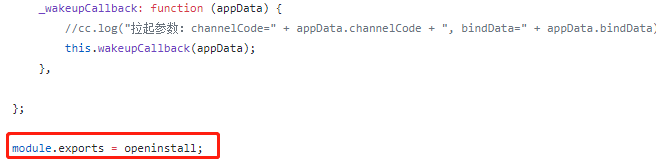
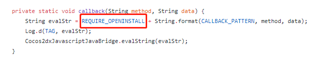
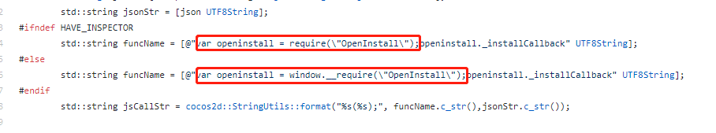

## Cocos2d-js 集成  
cocos2d-js 直接集成需要做以下修改

#### 修改脚本 
删除 `openinstall.js` 文件中的模块导入语句  

  

将js放入工程后，使用时不再使用 `require` 语句，而是将 openinstall.js 加入 `project.json` 的 `jsList` 数组中

#### 修改Android文件
找到 `Android/src/io/openinstall/cocos2dx/OpenInstallHelper.java` 将回调中的 `require`语句删除  

#### 修改iOS文件
找到 `iOS/OpeninstallCocosJS/IOSOpenInstallDelegate.mm` 和 `iOS/OpeninstallCocosJS/IOSOpenInstallBridge.mm`，修改回调语句，将 `require`语句删除  

